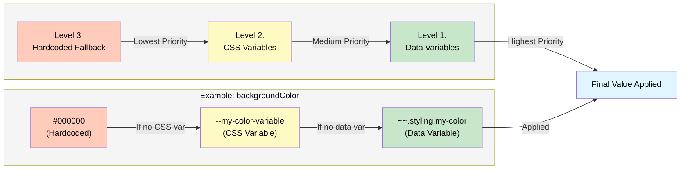

# Styling Strategy: Multi-Level Style System

This document explains the multi-level styling strategy used in Reactive-JSON applications, which provides a flexible, maintainable, and reusable approach to managing CSS styles (colors, spacing, typography, borders, etc.) across components.

## Overview

The styling strategy uses a three-level hierarchy for style resolution:

1. **Data Variables**: Runtime-configurable values accessible via template references from the `data` section
2. **CSS Variables**: Global CSS custom properties with fallback chains
3. **Hardcoded Fallbacks**: Final fallback values when no variables are available

This approach ensures maximum flexibility while maintaining consistency and providing sensible defaults.

## Resolution Hierarchy

The system resolves styles in the following order, from least to most priority:



## Implementation Levels

Here's a complete example showing all three levels working together:

```yaml
renderView:
  - type: div
    attributes:
      style:
        # LEVEL 1: Data Variables (Highest Priority)
        # Uses value from data if available: ~~.styling.colors.background.card
        backgroundColor: ~~.styling.colors.background.card
        padding: ~~.styling.spacing.cardPadding
    attributeTransforms:
      - what: setAttributeValue
        name: style
        value:
          # LEVEL 2: CSS Variables (Medium Priority)
          # Falls back to CSS variables if data variables are empty
          backgroundColor: "var(--color-card-background, #070707)"
          padding: "var(--spacing-card-padding, 1.5rem)"
          # LEVEL 3: Hardcoded Fallbacks (Lowest Priority)
          # Final fallback values used if CSS variables are not defined
          # In this case: #070707 and 1.5rem are the hardcoded fallbacks
        when: ~~.styling.colors.background.card
        isEmpty: true

data:
  styling:
    colors:
      background:
        card: "#0a0a0a"
    spacing:
      cardPadding: "2rem"
```

**Result**: The component will use:
- **If data variable exists**: Value from data (e.g., `#0a0a0a` for backgroundColor, `2rem` for padding)
- **If data variable is empty but CSS variable exists**: Value from CSS (e.g., `#070707` for backgroundColor, `1.5rem` for padding)
- **If both are empty**: Hardcoded fallback value (e.g., `#070707` for backgroundColor, `1.5rem` for padding)

### Level 1: Data Variables (Runtime Configuration)

Data variables are defined in the `data` section of your RjBuild and accessed via template references. They can contain any CSS property values:

```yaml
data:
  styling:
    colors:
      background:
        card: "#070707"
      border:
        card: "#292929"
    spacing:
      cardPadding: "1.5rem"
      cardGap: "1rem"
    typography:
      cardTitleSize: "1.25rem"
      cardTitleWeight: "600"
    border:
      cardRadius: "0.5rem"
      cardWidth: "1px"
```

**Usage in components:**

```yaml
renderView:
  - type: div
    attributes:
      style:
        backgroundColor: ~~.styling.colors.background.card
        borderColor: ~~.styling.colors.border.card
        padding: ~~.styling.spacing.cardPadding
        borderRadius: ~~.styling.border.cardRadius
        borderWidth: ~~.styling.border.cardWidth
      class: "text-[~~.styling.typography.cardTitleSize] font-[~~.styling.typography.cardTitleWeight]"
```

**Advantages:**
- Runtime configuration without code changes: styles can be overridden via data without modifying component code
- Can be loaded from external sources
- Supports dynamic theming
- Accessible via template system (`~~.` for global data)
- Works for any CSS property (colors, spacing, typography, borders, shadows, etc.)

### Level 2: CSS Variables (Global Stylesheet)

CSS variables are defined in your global stylesheet (`index.css`) and can be chained for specificity. They can represent any CSS property value:

```css
:root {
  /* Colors */
  --color-card-background: #070707;
  --color-card-border: #292929;
  --color-background-default: #000000;
  
  /* Spacing */
  --spacing-card-padding: 1.5rem;
  --spacing-card-gap: 1rem;
  --spacing-default: 1rem;
  
  /* Typography */
  --font-card-title-size: 1.25rem;
  --font-card-title-weight: 600;
  --font-default-size: 1rem;
  
  /* Borders */
  --border-card-radius: 0.5rem;
  --border-card-width: 1px;
  --border-default-radius: 0.25rem;
}
```

**Usage:**

```yaml
renderView:
  - type: div
    attributes:
      class: "text-[var(--font-card-title-size)] font-[var(--font-card-title-weight)]"
    attributeTransforms:
      - what: setAttributeValue
        name: style
        value:
          backgroundColor: "var(--color-card-background)"
          borderColor: "var(--color-card-border)"
          padding: "var(--spacing-card-padding)"
          borderRadius: "var(--border-card-radius)"
```

**Advantages:**
- Global consistency across all components
- Theme switching capability
- Browser-native support
- Can be overridden per component or section: follows the same CSS inheritance logic as HTML (redefining a CSS variable applies that value to all children)
- Works for any CSS property type

### Level 3: Hardcoded Fallbacks (Final Safety Net)

Hardcoded values provide the final fallback when no variables are available. These can be any CSS property values:

```yaml
attributeTransforms:
  - what: setAttributeValue
    name: style
    value:
      backgroundColor: "var(--color-card-background, #070707)"
      borderColor: "var(--color-card-border, #292929)"
      padding: "var(--spacing-card-padding, 1.5rem)"
      borderRadius: "var(--border-card-radius, 0.5rem)"
      boxShadow: "var(--shadow-card, 0 4px 6px rgba(0,0,0,0.1))"
    when: ~~.__styles.colors.background.card
    isEmpty: true
```

**Advantages:**
- Guarantees component functionality
- Works even if CSS fails to load
- Provides sensible defaults
- No dependency on external systems
- Applies to all CSS properties (colors, spacing, typography, borders, shadows, transforms, etc.)

## Complete Example

Here's a complete example showing all three levels working together for various CSS properties:

### 1. Define CSS Variables (`index.css`)

```css
:root {
  /* Colors */
  --color-card-background: #070707;
  --color-card-border: #292929;
  --color-background-default: #000000;
  
  /* Spacing */
  --spacing-card-padding: 1.5rem;
  --spacing-card-gap: 1rem;
  --spacing-default: 1rem;
  
  /* Typography */
  --font-card-title-size: 1.25rem;
  --font-card-title-weight: 600;
  
  /* Borders */
  --border-card-radius: 0.5rem;
  --border-card-width: 1px;
}
```

### 2. Define Data Variables (`data` section)

```yaml
data:
  styling:
    colors:
      background:
        card: "#070707"
      border:
        card: "#292929"
    spacing:
      cardPadding: "1.5rem"
      cardGap: "1rem"
    typography:
      cardTitleSize: "1.25rem"
      cardTitleWeight: "600"
    border:
      cardRadius: "0.5rem"
      cardWidth: "1px"
```

### 3. Component Implementation

```yaml
renderView:
  - type: div
    attributes:
      class: border rounded-2xl overflow-hidden flex flex-col
      style:
        # Primary: Use data variables if available
        backgroundColor: ~~.styling.colors.background.card
        borderColor: ~~.styling.colors.border.card
        padding: ~~.styling.spacing.cardPadding
        borderRadius: ~~.styling.border.cardRadius
        borderWidth: ~~.styling.border.cardWidth
    attributeTransforms:
      # Fallback: Use CSS variables with hardcoded defaults
      - what: setAttributeValue
        name: style
        value:
          backgroundColor: "var(--color-card-background, #070707)"
          borderColor: "var(--color-card-border, #292929)"
          padding: "var(--spacing-card-padding, 1.5rem)"
          borderRadius: "var(--border-card-radius, 0.5rem)"
          borderWidth: "var(--border-card-width, 1px)"
        when: ~~.styling.colors.background.card
        isEmpty: true
```

## Variable Chaining Strategy

For maximum flexibility, use CSS variable chaining from most specific to least specific. This works for any CSS property:

```css
:root {
  /* Most specific: Component-level */
  --color-card-background: #070707;
  --spacing-card-padding: 1.5rem;
  --font-card-title-size: 1.25rem;
  --border-card-radius: 0.5rem;
  
  /* Medium specificity: Category-level */
  --color-background-interactive: #0a0a0a;
  --spacing-interactive-padding: 1.25rem;
  --font-interactive-size: 1.125rem;
  
  /* Least specific: Global defaults */
  --color-background-default: #000000;
  --spacing-default: 1rem;
  --font-default-size: 1rem;
  --border-default-radius: 0.25rem;
}
```

**Usage with chaining:**

```yaml
style:
  backgroundColor: "var(--color-card-background, var(--color-background-interactive, var(--color-background-default, #070707)))"
  padding: "var(--spacing-card-padding, var(--spacing-interactive-padding, var(--spacing-default, 1.5rem)))"
  fontSize: "var(--font-card-title-size, var(--font-interactive-size, var(--font-default-size, 1.25rem)))"
  borderRadius: "var(--border-card-radius, var(--border-default-radius, 0.5rem))"
```

## Benefits

### Reusability

Components can share the same styling system without code duplication.

### Flexibility

Multiple configuration points allow for different use cases:

- **Runtime theming**: Change data variables dynamically
- **Global theming**: Override CSS variables for dark/light mode
- **Component-specific**: Use inline styles for one-off cases
- **Progressive enhancement**: Works even if JavaScript fails

### Simplicity

Developers only need to know one pattern:

```yaml
style:
  property: "var(--specific-var, var(--generic-var, hardcoded-fallback))"
```

This pattern is:
- Easy to understand
- Consistent across all components
- Self-documenting
- Maintainable

## Best Practices

### 1. Always Provide Fallbacks

Every variable should have a fallback chain, regardless of the CSS property:

```yaml
# ✅ Good - Works for any CSS property
backgroundColor: "var(--color-card-background, #070707)"
padding: "var(--spacing-card-padding, 1.5rem)"
fontSize: "var(--font-card-title-size, 1.25rem)"
borderRadius: "var(--border-card-radius, 0.5rem)"

# ❌ Bad - No fallback
backgroundColor: "var(--color-card-background)"
padding: "var(--spacing-card-padding)"
```

### 2. Use Specificity Hierarchy

Order variables from most specific to least specific:

```css
/* ✅ Good: Specific → Generic → Fallback */
var(--spacing-card-padding, var(--spacing-interactive-padding, var(--spacing-default, 1.5rem)))
var(--font-card-title-size, var(--font-interactive-size, var(--font-default-size, 1.25rem)))

/* ❌ Bad: Generic → Specific */
var(--spacing-default, var(--spacing-card-padding, 1.5rem))
```

### 3. Document Variable Purpose

Add comments explaining variable usage and property type:

```css
:root {
  /* Colors */
  --color-card-background: #070707; /* Card component background */
  --color-background-default: #000000; /* Default background fallback */
  
  /* Spacing */
  --spacing-card-padding: 1.5rem; /* Card component padding */
  --spacing-default: 1rem; /* Default spacing fallback */
  
  /* Typography */
  --font-card-title-size: 1.25rem; /* Card title font size */
  --font-default-size: 1rem; /* Default font size fallback */
}
```

### 4. Use Data Variables for Runtime Changes

Prefer data variables when values need to change at runtime:

```yaml
# ✅ Good: Runtime configurable for any property
backgroundColor: ~~.__styles.colors.background.card
padding: ~~.__styles.spacing.cardPadding
fontSize: ~~.__styles.typography.cardTitleSize

# ❌ Less flexible: Static CSS only
backgroundColor: "var(--color-card-background)"
padding: "var(--spacing-card-padding)"
```

## Real-World Example

Here's how the VideoCard component implements this strategy:

```yaml
renderView:
  - type: div
    attributes:
      class: border rounded-2xl overflow-hidden flex flex-col
      style:
        # Level 1: Try data variable first
        backgroundColor: ~~.__styles.colors.background.card
        borderColor: ~~.__styles.colors.border.card
    attributeTransforms:
      # Level 2 & 3: Fallback to CSS variables with hardcoded defaults
      - what: setAttributeValue
        name: style
        value:
          backgroundColor: "var(--color-card-background, #070707)"
          borderColor: "var(--color-card-border, #292929)"
        when: ~~.__styles.colors.background.card
        isEmpty: true
```

## Summary

The multi-level styling strategy provides:

- **Three-tier resolution**: Data → CSS → Hardcoded
- **Maximum flexibility**: Runtime and compile-time configuration
- **Robust fallbacks**: Always works, even if systems fail
- **Consistent patterns**: Same approach across all components
- **Easy maintenance**: Change once, apply everywhere
- **Universal application**: Works for all CSS properties (colors, spacing, typography, borders, shadows, transforms, animations, etc.)

This approach ensures your application is both flexible and maintainable, with styles that adapt to different contexts while maintaining consistency. Whether you're styling colors, spacing, typography, borders, or any other CSS property, the same three-level hierarchy applies.

